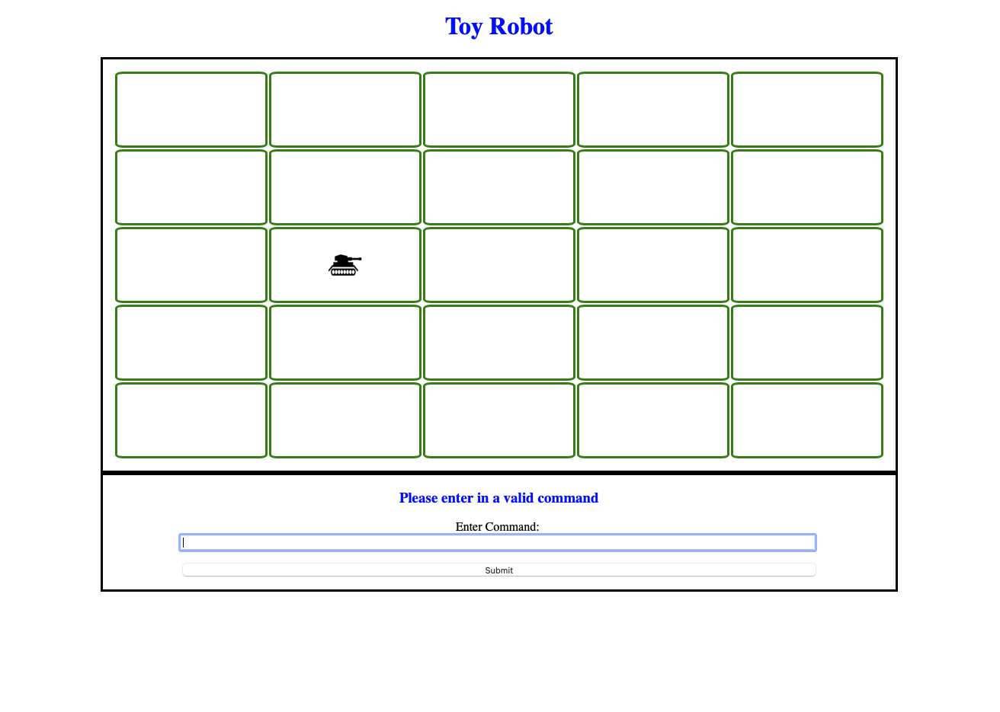

## Table of contents

-   [General info](#general-info)
-   [ToyRobot Link](#ToyRobot-link)
-   [Necessary Deliverables](#necessary-deliverable)
-   [To Do](#to-do)
-   [Screenshots](#screenshots)
-   [In-depth Features of ToyRobot](#in-depth-features-of-ToyRobot)
-   [Challenges](#challenges)
-   [Technologies Used](#technologies-used)
-   [Approach Taken](#approach-taken)
-   [Download](#download)

## General info

This project is to demonstrate and conform to the coding challenge requirements found below:

-   The application is a simulation of a toy robot moving on a square tabletop
-   The table top should have dimensions of 5 units x 5 units
-   There are no obstructions on the table surface
-   The robot is free to roam around the surface of the table, but must be prevented from falling to destruction
-   Any movement that would result in the robot falling from the table must be prevented, however further valid movement commands must still be allowed

Create an application that can read in commands of the following form:

```
PLACE X,Y,FACING
MOVE
LEFT
RIGHT
REPORT
```

**PLACE** will put the toy robot on the table in position X, Y and facing NORTH, SOUTH, EAST or WEST.

-   The origin (0,0) can be considered to be the SOUTH WEST most corner
-   The first valid command to the robot is a PLACE command, after that, any sequence of commands may be issued, in any order, including another PLACE command
-   The application should discard all commands in the sequence until a valid PLACE command has been executed

**MOVE** will move the toy robot one unit forward in the direction it is currently facing.

**LEFT** and **RIGHT** will rotate the robot 90 degrees in the specified direction without changing the position of the robot. Ie. the facing should change but the position should not.

**REPORT** will announce the X, Y and FACING of the robot. This can be in any form, but standard output is sufficient.

-   A robot that is not on the table can choose to ignore the MOVE, LEFT, RIGHT and REPORT commands
-   Input can be from a file, or from standard input, as the developer chooses
-   Provide test data to exercise the application

## Constraints:

The toy robot must not fall off the table during movement. This also includes the initial placement of the toy robot.
Any move that would cause the robot to be outside of the bounds of the table should be prevented or ignored.

### Example Input and Output:

#### A

```
PLACE 0, 0, NORTH
MOVE
REPORT
```

Output: 0, 1, NORTH

#### B

```
PLACE 0, 0, NORTH
LEFT
REPORT
```

Output: 0, 0, WEST

```
PLACE 1, 2, EAST
MOVE
MOVE
LEFT
MOVE
REPORT
```

Output: 3, 3, NORTH

## Dockerization

As part of your submission please include the necessary files such that your challenge can be run by executing `docker-compose up`.

## ToyRobot Link

-   The link to the ToyRobot online application is here:
    [https://ToyRobot.herokuapp.com]
-   Public ER Diagram link:
    [https://whimsical.com/M9h9oNGHibMCgt7BQ5H4pn]

## To-Do

Need to do the following:

## Screenshots



## Challenges

-   Learning the basics of Docker. (i.e. create docker hub account, read through their geting-started documentation etc) and then applying these commands to my own project.

## Approach Taken

-   Reviewed the requirements.
-   Drew a basic ER Diagram to represent the entities involved.
-   Then wrote down a basic algorithm with defined or what I perceived to be the correct function calls.

## Technologies Used

Project is created with:

-   Javascript
-   CSS
-   HTML
-   DOM manipulation
-   Express (purely for including a dependency to test required Dockerfile and docker-compose.yml and learn more about Docker )

## Download

Download via:

-   https://github.com/mistergjones/toyrobotjs
